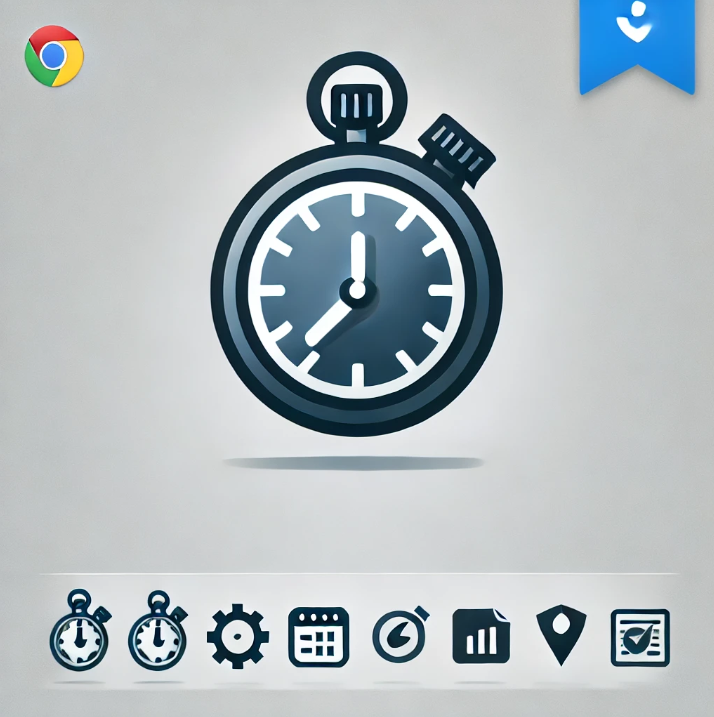

# TimeTracker

A sleek, modern productivity application for tracking how you spend time on your computer. TimeTracker automatically logs your activities as you work, categorizing them by application and website to provide insightful data about your digital habits.



## Features

- **Automatic Activity Tracking**: Monitors which applications and websites you use in real-time
- **Hierarchical View**: Organizes your time data in a three-level hierarchy:
  - Application (e.g., Chrome, Word)
  - Domain (e.g., Reddit, YouTube, or application-specific windows)
  - Individual page/window titles
- **Project Management**: Create separate projects to track different types of work
- **Modern Dark Theme**: Easy on the eyes with a professional aesthetic
- **System Tray Integration**: Runs in the background with quick access via system tray
- **Persistent Database**: Stores all your activity data locally using SQLite

## Requirements

- Python 3.6+
- PyQt5
- Windows (for win32gui and win32process modules)
- psutil

## Installation

1. Clone this repository or download the source code:
```
git clone https://github.com/sauhumatti/TimeTracker.git
cd TimeTracker
```

2. Install required dependencies:
```
pip install PyQt5 pywin32 psutil
```

## Running the Application

Launch the application by running:

```
python main.py
```

The app will start and appear in your system tray. Click the tray icon to show the main window.

## Usage Guide

### Getting Started

1. **Start Tracking**: Click the green "Start Tracking" button to begin monitoring your activities
2. **Select a Project**: Use the dropdown to choose which project to associate your activities with
3. **Create New Projects**: Click "New Project" to create categories for different types of work
4. **View Your Data**: The main tree view shows a breakdown of your time usage for the day

### Understanding the Data

- **Application Level**: The top level shows applications (Chrome, Word, etc.)
- **Domain Level**: The second level groups similar sites or windows
- **Detail Level**: The third level shows specific window titles or web pages

### Managing Projects

- Create different projects to track time spent on various types of work
- Switch between projects to view time data for each
- Edit or delete projects as needed

### System Tray

- The app runs in the background even when closed
- Access the app quickly through the system tray icon
- Right-click the tray icon for options including Quit

## Customization

The app uses a modern dark theme by default, but you can modify the UI by editing the stylesheet definitions in `time_tracker_app.py`.

## Data Storage

All activity data is stored locally in a SQLite database (`timetracker.db`) in the same directory as the application.

## Contributing

Contributions are welcome! Feel free to fork this repository and submit pull requests with new features or bug fixes.

## License

This project is licensed under the MIT License - see the LICENSE file for details.

---

Created with ❤️ for better productivity